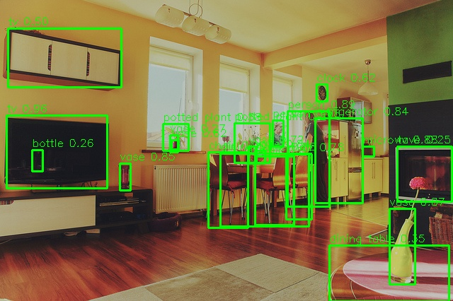

# KV260 YOLOv7 物体検出 (DPU B4096)

YOLOv7をVitis AI 3.5で量子化し、KV260のDPU上で物体検出を実行する。

## 検出結果



- 推論時間: 190ms（約5.3FPS）
- 検出対象: COCO 80クラス（person, car, chair, tv 等）

## ファイル構成

```
kv260_yolov7_dpu/
├── yolov7_inference.py   ... KV260上の推論スクリプト（前後処理+DPU実行）
├── run_yolo.sh           ... Docker経由で推論を実行するラッパー
├── meta.json             ... コンパイル済みxmodelのメタ情報
└── README.md
```

xmodelファイル（39MB）はサイズが大きいためリポジトリには含めない。
後述の手順で再生成可能。

## システム構成

```
[ホストPC]                              [KV260]
 Ubuntu 24.04                            Ubuntu 22.04
 RTX 5070 Ti                             DPU B4096 (300MHz)
 Vitis AI 3.5 Docker                     Vitis AI Runtime 2.5
   │                                       │
   ├─ YOLOv7 float model (yolov7.pt)      ├─ yolov7_kv260.xmodel
   ├─ PTQ量子化 (vai_q_pytorch)            ├─ yolov7_inference.py
   ├─ コンパイル (vai_c_xir)               └─ vai-yolov7:v1 Docker
   └─ xmodel → scp転送 →──────────────────→
```

## 量子化の流れ

### 1. 環境準備（ホストPC）

Vitis AI GPU Dockerイメージをビルド:
```
cd /mnt/data/fpga/Vitis-AI/docker
sg docker -c "yes y | bash docker_build.sh -t gpu -f pytorch"
```

Copyleft Model Zooからソース取得:
```
git clone https://github.com/Xilinx/Vitis-AI-Copyleft-Model-Zoo.git
```

YOLOv7 weightsダウンロード:
```
cd Vitis-AI-Copyleft-Model-Zoo/yolov7/yolov7
wget https://github.com/WongKinYiu/yolov7/releases/download/v0.1/yolov7.pt
```

COCO2017データセット:
```
bash scripts/get_coco.sh
```

### 2. コンテナ起動

```
sg docker -c "docker run -d --name vitis-ai-yolo -v /mnt/data/fpga:/workspace -w /workspace xilinx/vitis-ai-pytorch-gpu:3.5.0.001-77cb9e6 sleep infinity"
```

RTX 5070 Ti（Blackwell/sm_120）はPyTorch 1.13非対応のため、GPUなしで起動。
キャリブレーションはCPUで実行する。

### 3. PTQ量子化（キャリブレーション）

```
python test_nndct.py \
  --data data/coco.yaml --img 640 --batch 1 \
  --conf 0.001 --iou 0.65 --device cpu \
  --weights yolov7.pt --name yolov7_640_val \
  --quant_mode calib \
  --nndct_convert_sigmoid_to_hsigmoid \
  --nndct_convert_silu_to_hswish \
  --no-trace
```

- `--nndct_convert_silu_to_hswish`: SiLU→HSwish変換（DPU非対応のSigmoidを回避）
- `--no-trace`: traceモードのimg_size異常値を回避
- キャリブレーション枚数はtest_nndct.pyの`total = 1000`と`batch_i == 999`を変更して調整可能（200枚で約40分@CPU）

### 4. xmodel出力

```
python test_nndct.py \
  --data data/coco.yaml --img 640 --batch 1 \
  --conf 0.001 --iou 0.65 --device cpu \
  --weights yolov7.pt --name yolov7_640_val \
  --quant_mode test \
  --nndct_convert_sigmoid_to_hsigmoid \
  --nndct_convert_silu_to_hswish \
  --no-trace --dump_model
```

→ `nndct/Model_0_int.xmodel` が生成される

### 5. KV260向けコンパイル

VAI 3.5のarch.jsonはfingerprint不一致のため、実機のfingerprintを直接指定:

```
echo '{"fingerprint":"0x101000016010407"}' > /tmp/kv260_arch.json
vai_c_xir -x nndct/Model_0_int.xmodel -a /tmp/kv260_arch.json -o compiled -n yolov7_kv260
```

```
コンパイル結果:
  Target: DPUCZDX8G_ISA1_B4096_0101000016010407
  DPUサブグラフ: 1個
  デバイスサブグラフ: 5個
  xmodelサイズ: 39MB
```

## KV260での実行

### 準備

```
# ホストPCからxmodelと推論スクリプトを転送
scp yolov7_kv260.xmodel ubuntu@192.168.0.14:~/
scp yolov7_inference.py ubuntu@192.168.0.14:~/
scp run_yolo.sh ubuntu@192.168.0.14:~/

# KV260でDPUファームウェアをロード
sudo xmutil unloadapp
sudo xmutil loadapp kv260-benchmark-b4096
```

### 推論実行

```
bash ~/run_yolo.sh test.jpg
```

出力:
```
Input shape: [1, 640, 640, 3]
Output[0] shape: [1, 80, 80, 255], fixpos: 2
Output[1] shape: [1, 40, 40, 255], fixpos: 2
Output[2] shape: [1, 20, 20, 255], fixpos: 3
Inference time: 190.5 ms
Detections: 22
  tv: 0.962 [9,163,151,266]
  chair: 0.904 [294,215,350,322]
  person: 0.892 [406,157,465,292]
  ...
```

## 後処理の仕組み

YOLOv7のDPU出力はグリッドベースのraw値。ピクセル座標への変換が必要:

```
出力テンソル: 3スケール
  80×80 (stride 8)  → 小さい物体
  40×40 (stride 16) → 中くらいの物体
  20×20 (stride 32) → 大きい物体

各セル × 3アンカー × 85値 (cx, cy, w, h, obj_conf, 80クラス)

デコード:
  cx_pixel = (sigmoid(cx) * 2 - 0.5 + grid_x) * stride
  cy_pixel = (sigmoid(cy) * 2 - 0.5 + grid_y) * stride
  w_pixel  = (sigmoid(w) * 2)^2 * anchor_w
  h_pixel  = (sigmoid(h) * 2)^2 * anchor_h
```

アンカーサイズ:
| スケール | stride | アンカー |
|---------|--------|---------|
| 80×80 | 8 | [12,16], [19,36], [40,28] |
| 40×40 | 16 | [36,75], [76,55], [72,146] |
| 20×20 | 32 | [142,110], [192,243], [459,401] |

## トラブルシューティング

| 問題 | 原因 | 対処 |
|------|------|------|
| `CUDA capability sm_120 is not compatible` | RTX 5070 TiはPyTorch 1.13非対応 | `--device cpu`でCPU実行 |
| `img_size must be multiple of max stride 3.36e+07` | traceモードでstride計算異常 | `--no-trace`オプション追加 |
| `fingerprint check failure` | VAI 3.5 arch.jsonと実機DPUの不一致 | fingerprint直接指定でコンパイル |
| `boost::filesystem: No such file: /dev/dri/by-path/` | Dockerに/dev/driが未マウント | `-v /dev/dri:/dev/dri`または`-v /dev:/dev` |
| `Check failed: !get_factory().empty()` | XRTデバイス未マウント | `--privileged -v /dev:/dev -v /run:/run` + XLNX_VART_FIRMWARE環境変数 |
| 座標が全部[0,0,0,0] | アンカーデコード未実装 | グリッドオフセット+アンカーサイズで変換 |

## 環境

- ホストPC: Ubuntu 24.04, RTX 5070 Ti, Vitis AI 3.5 Docker
- KV260: Ubuntu 22.04, DPU B4096 (DPUCZDX8G_ISA1_B4096), XRT 2.13.0
- YOLOv7: Copyleft Model Zoo版, 640×640入力, COCO 80クラス
- 量子化: PTQ, 200枚キャリブレーション, SiLU→HSwish変換
