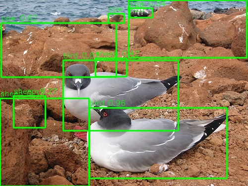
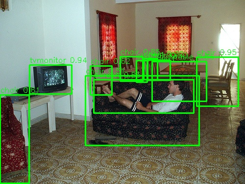
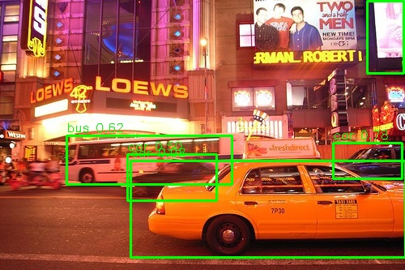

# KV260 YOLOv7 Pascal VOC 転移学習 → DPU推論

YOLOv7をPascal VOC（20クラス）で転移学習し、Vitis AI 3.5で量子化、KV260のDPU B4096上で物体検出を実行する。

## 検出結果

### 鳥


| 検出 | 信頼度 |
|------|--------|
| bird | 0.961, 0.868 |
| cow/sheep（誤検出） | 0.27〜0.62 |

### 室内


| 検出 | 信頼度 |
|------|--------|
| chair | 0.952 |
| tvmonitor | 0.938 |
| person | 0.852 |
| diningtable | 0.558 |

### 街路


| 検出 | 信頼度 |
|------|--------|
| car | 0.980, 0.777, 0.499 |
| bus | 0.616 |
| tvmonitor（電光掲示板を誤検出） | 0.678 |

**性能**: 167ms/frame（約6FPS）、全画像で同じ推論時間

## ファイル構成

```
kv260_yolov7_voc/
├── yolov7_inference.py     ... 推論スクリプト（前後処理+DPU実行）
├── run_yolo.sh             ... Docker経由で推論を実行するラッパー
├── meta.json               ... xmodelのメタ情報
├── test_voc.jpg            ... テスト画像1（鳥）
├── test_voc_result.jpg     ... 検出結果1
├── test_room.jpg           ... テスト画像2（室内）
├── test_room_result.jpg    ... 検出結果2
├── test_street.jpg         ... テスト画像3（街路）
├── test_street_result.jpg  ... 検出結果3
└── README.md
```

xmodelファイル（39MB）はサイズが大きいためリポジトリには含めない。後述の手順で再生成可能。

## システム構成

```
[ホストPC]                              [KV260]
 Ubuntu 24.04                            Ubuntu 22.04
 RTX 5070 Ti                             DPU B4096 (300MHz)
                                         VART 2.5 (Docker内)
   │                                       │
   ├─ YOLOv7 + COCO事前学習                ├─ yolov7_voc_kv260.xmodel
   ├─ Pascal VOC転移学習 (PyTorch 2.7/GPU) ├─ yolov7_inference.py
   ├─ PTQ量子化 (Vitis AI 3.5)             └─ vai-yolov7:v4 Docker
   ├─ コンパイル (vai_c_xir)
   └─ xmodel → scp転送 →──────────────────→
```

## 構築の流れ

### 1. 転移学習用データ準備（ホストPC）

Pascal VOC 2007+2012をダウンロード:

```
wget http://host.robots.ox.ac.uk/pascal/VOC/voc2007/VOCtrainval_06-Nov-2007.tar
wget http://host.robots.ox.ac.uk/pascal/VOC/voc2007/VOCtest_06-Nov-2007.tar
wget http://host.robots.ox.ac.uk/pascal/VOC/voc2012/VOCtrainval_11-May-2012.tar
```

YOLOフォーマットに変換 → train 16551枚、val 4952枚

### 2. 転移学習（GPU使用）

COCO事前学習済みweightをベースに10エポック転移学習。

RTX 5070 Ti（sm_120）はPyTorch 1.13非対応のため、別途nvcr.io/nvidia/pytorch:25.04-py3（PyTorch 2.7/CUDA 12.9）を使用。

```
python train.py \
  --data data/voc.yaml \
  --cfg cfg/training/yolov7.yaml \
  --weights yolov7.pt \
  --epochs 10 --batch-size 16 --img 640 \
  --name yolov7-voc
```

### 3. PTQ量子化（Vitis AI 3.5 Docker）

別のVitis AI 3.5 Dockerに切替（PyTorch 1.13、CPU実行）。weightsは互換性のため再保存しておく。

```
python test_nndct.py \
  --data data/voc.yaml --img 640 --batch 1 \
  --weights best_compat.pt \
  --quant_mode calib \
  --nndct_convert_sigmoid_to_hsigmoid \
  --nndct_convert_silu_to_hswish \
  --no-trace
```

- キャリブレーション: 50枚（test_nndct.pyの`total = 50`と`batch_i == 49`に変更）
- SiLU→HSwish変換: DPU非対応のSiLUを回避

### 4. xmodel出力

```
python test_nndct.py \
  --data data/voc.yaml --img 640 --batch 1 \
  --weights best_compat.pt \
  --quant_mode test \
  --nndct_convert_sigmoid_to_hsigmoid \
  --nndct_convert_silu_to_hswish \
  --no-trace --dump_model
```

→ `nndct/Model_0_int.xmodel` が生成される

### 5. KV260向けコンパイル

実機のfingerprintを直接指定（VAI 3.5の標準arch.jsonとは不一致）:

```
echo '{"fingerprint":"0x101000016010407"}' > /tmp/kv260_arch.json
vai_c_xir -x nndct/Model_0_int.xmodel -a /tmp/kv260_arch.json -o compiled -n yolov7_voc_kv260
```

出力:
- Target: DPUCZDX8G_ISA1_B4096_0101000016010407
- DPUサブグラフ: 1個
- xmodelサイズ: 39MB

## KV260でのDocker環境構築

KV260のapt版`vitis-ai-runtime` 2.0ではxmodel実行時にsegfaultするため、Xilinx公式のVART 2.5入りDockerイメージを使う。

```
sudo docker pull xilinx/kria-runtime:2022.1
sudo docker run -d --name vai-builder xilinx/kria-runtime:2022.1 sleep 300
sudo docker exec vai-builder pip install opencv-python-headless numpy
sudo docker commit vai-builder vai-yolov7:v4
sudo docker rm -f vai-builder
```

## KV260での推論実行

### 準備

```
# ホストPCからxmodelとスクリプトを転送
scp yolov7_voc_kv260.xmodel ubuntu@192.168.0.19:~/
scp yolov7_inference.py ubuntu@192.168.0.19:~/
scp test_*.jpg ubuntu@192.168.0.19:~/

# KV260でDPUファームウェアをロード
sudo xmutil unloadapp
sudo xmutil loadapp kv260-benchmark-b4096
```

### 推論実行

```
bash ~/run_yolo.sh test_voc.jpg
```

出力例:
```
Input shape: [1, 640, 640, 3]
Output[0] shape: [1, 80, 80, 75], fixpos: 1
Output[1] shape: [1, 40, 40, 75], fixpos: 2
Output[2] shape: [1, 20, 20, 75], fixpos: 2
Inference time: 167.1 ms
Detections: 9
  bird: 0.961 [180,217,457,359]
  ...
```

## 後処理

VOC 20クラス用にYOLOヘッドの出力チャネル数が変わる:

```
出力テンソル: 3スケール × 3アンカー × 25値 (cx, cy, w, h, obj, 20クラス)
  80×80 (stride 8)  → 小さい物体
  40×40 (stride 16) → 中くらいの物体
  20×20 (stride 32) → 大きい物体

デコード:
  cx_pixel = (sigmoid(cx) * 2 - 0.5 + grid_x) * stride
  cy_pixel = (sigmoid(cy) * 2 - 0.5 + grid_y) * stride
  w_pixel  = (sigmoid(w) * 2)^2 * anchor_w
  h_pixel  = (sigmoid(h) * 2)^2 * anchor_h
```

## トラブルシューティング

| 問題 | 原因 | 対処 |
|------|------|------|
| `CUDA capability sm_120 not supported` | PyTorch 1.13がBlackwell非対応 | 学習はPyTorch 2.7（nvcr.io/nvidia/pytorch:25.04）、量子化はVitis AI 3.5の別Dockerに分離 |
| `torch.load` weights_only エラー | PyTorch 2.7のデフォルト変更 | train.py等6ファイルで`weights_only=False`を追加 |
| `pytorch_nndct ModuleNotFoundError` | 学習Dockerにnndctが無い | common.pyのConcatとSPPCSPCにtry/exceptフォールバック |
| `fingerprint check failure` | VAI 3.5のarch.jsonと実機DPUが不一致 | fingerprint直接指定でコンパイル |
| ホスト側Python実行でsegfault | apt版`vitis-ai-runtime` 2.0と3.5 xmodelの不一致 | `xilinx/kria-runtime:2022.1` Docker（VART 2.5）で実行 |
| ソファをchairと誤検出 | 10エポック学習で`sofa`クラスが未収束 | エポック数増やすorQAT |

## 環境

- ホストPC: Ubuntu 24.04, RTX 5070 Ti, Vitis AI 3.5 Docker
- KV260: Ubuntu 22.04, DPU B4096 (DPUCZDX8G_ISA1_B4096), XRT 2.13.0
- YOLOv7: COCO事前学習 → Pascal VOC 20クラス転移学習（10エポック）
- 量子化: PTQ, 50枚キャリブレーション, SiLU→HSwish変換

## 性能まとめ

| 画像 | 検出数 | 主検出 | 推論時間 |
|------|--------|--------|----------|
| test_voc.jpg | 9 | bird×2 | 167ms |
| test_room.jpg | 11 | person, tvmonitor, chair, diningtable | 167ms |
| test_street.jpg | 5 | car×3, bus | 167ms |

全画像で 167ms (約6FPS) 安定動作。
